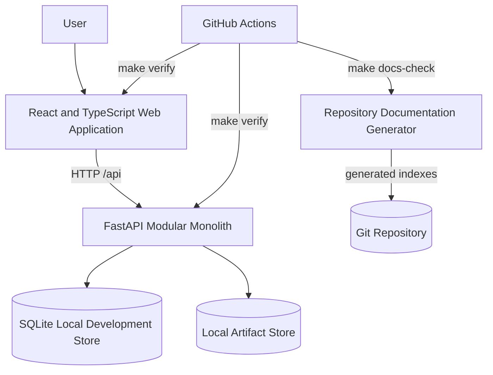

# Container View

| Field | Value |
|---|---|
| Document ID | TDP-ARC-002 |
| Status | Controlled draft |
| Owner | Architecture |
| Classification | Internal project documentation |
| Review cadence | At each material change or release |
| Source of truth | This repository |

## Containers

| Container | Responsibility | Current status |
|---|---|---|
| React web application | Navigation, workspaces, evidence intake, review UI | Implemented |
| FastAPI application | Use cases, domain orchestration, HTTP boundary | Implemented |
| SQLite database | Local metadata and lifecycle persistence | Development only |
| Local artifact store | Uploaded source evidence | Development only |
| Documentation generator | Repository-derived indexes and freshness checks | Implemented by Patch 0009.11 |
| GitHub Actions | Reproducible quality gate | Implemented |

## Planned production substitutions

- PostgreSQL for relational persistence;
- durable object storage for source and generated artifacts;
- OIDC identity provider;
- reverse proxy or gateway;
- metrics, tracing, centralized logs;
- background worker for long-running acquisition and generation.

These are architectural intentions, not implemented production capabilities.
