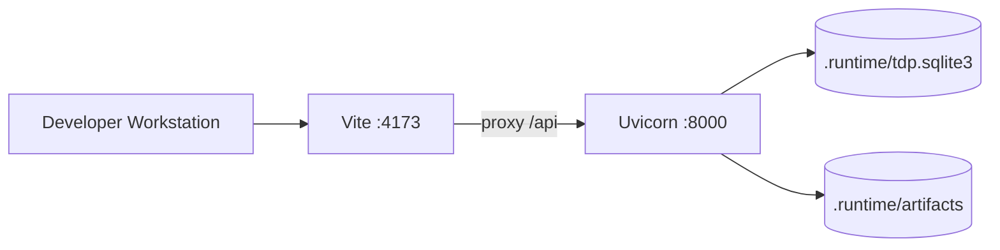
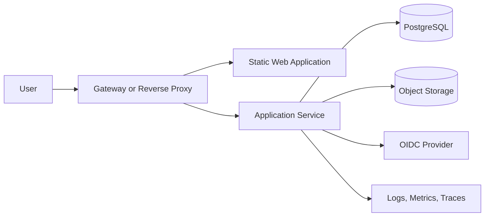

# Deployment View

| Field | Value |
|---|---|
| Document ID | TDP-ARC-007 |
| Status | Controlled draft |
| Owner | Architecture and Operations |
| Classification | Internal project documentation |
| Review cadence | At each material change or release |
| Source of truth | This repository |

## Current local deployment



Commands:

```bash
make dev-backend
make dev-frontend
```

## CI deployment context

GitHub Actions installs locked backend and frontend dependencies and runs `make verify`. CI verifies source; it does not deploy an environment.

## Target production topology



## Production prerequisites

- versioned schema migrations;
- immutable deployment artifact;
- environment-specific configuration and secret references;
- OIDC and authorization;
- backup and restore validation;
- liveness and readiness integration;
- monitoring, alerting, and incident ownership;
- vulnerability assessment;
- approved network and data-classification controls.

No Docker or production manifest is currently claimed as implemented.
