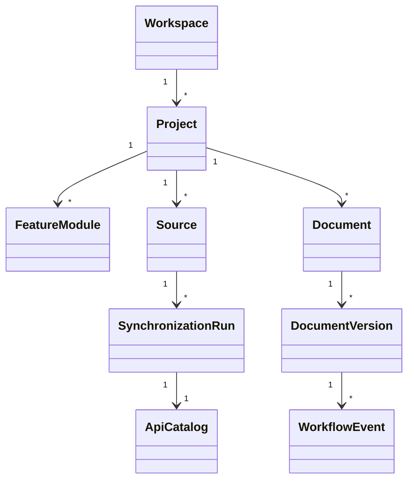
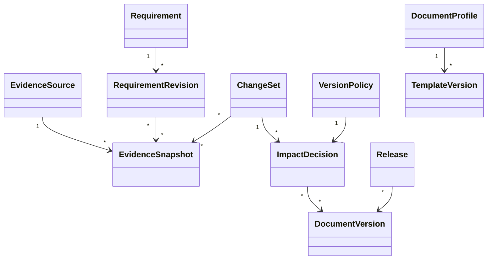

# Domain Model

| Field | Value |
|---|---|
| Document ID | TDP-ARC-004 |
| Status | Controlled draft |
| Owner | Architecture and Product |
| Classification | Internal project documentation |
| Review cadence | At each material change or release |
| Source of truth | This repository |

## Current hierarchy

## Current invariants

- Workspace, Project, Feature, Source, Document, and Version identities are stable.
- Archived governance boundaries remain readable and block new mutations.
- Source artifacts are checksummed.
- Synchronization snapshots are immutable.
- identical normalized document content reuses an existing checksum-backed version.
- lifecycle transitions are domain-controlled.
- workflow actor snapshots come from a server-resolved principal.

## Feature documentation baseline

The Feature or Module Registry defines required and optional document types through a versioned baseline policy. Existing project-scoped documents are not automatically mapped to a feature because that relationship is not yet supported by evidence.

## Planned domain expansion

The planned model is descriptive only until implemented through requirements, ADRs, code, and tests.
