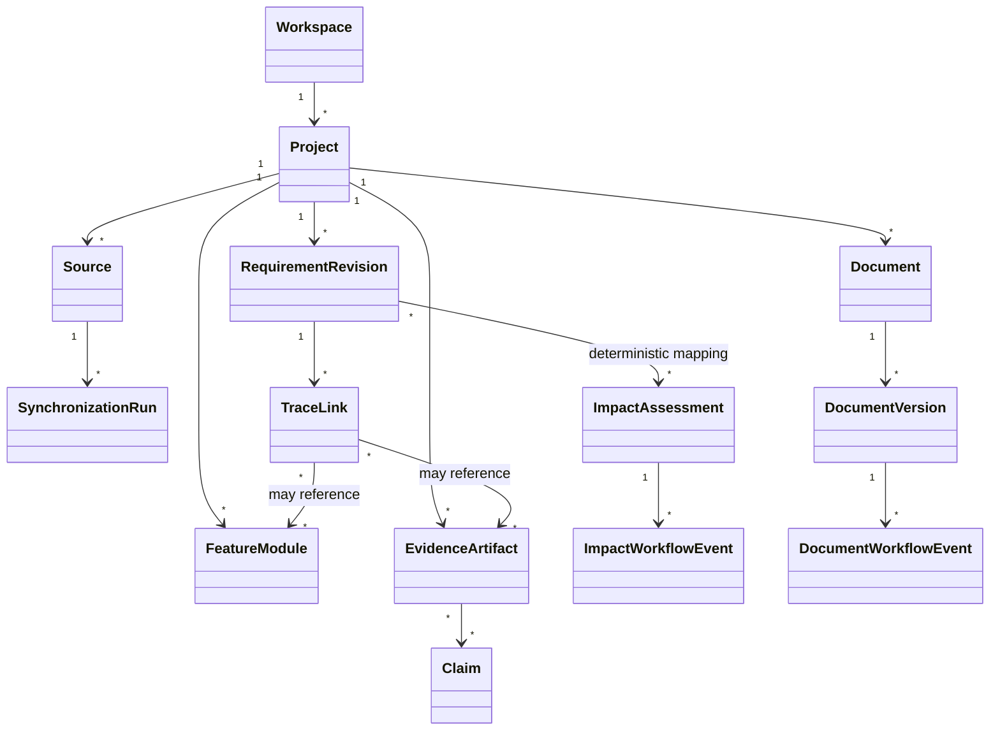
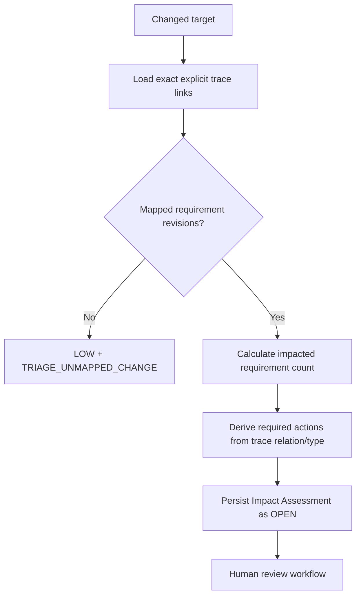
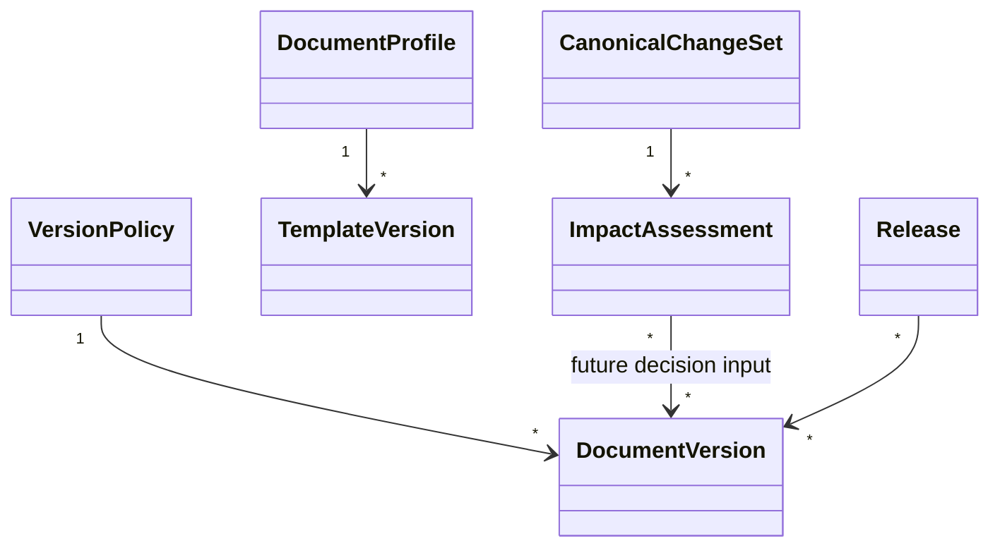

# Domain Model

| Field | Value |
|---|---|
| Document ID | TDP-ARC-004 |
| Status | Controlled draft |
| Owner | Architecture and Product |
| Classification | Internal project documentation |
| Review cadence | At each material change or release |
| Source of truth | This repository |

## Current hierarchy

```mermaid
classDiagram
class Workspace
class Project
class FeatureModule
class Source
class SynchronizationRun
class EvidenceArtifact
class Claim
class RequirementRevision
class TraceLink
class ImpactAssessment
class ImpactWorkflowEvent
class Document
class DocumentVersion
class DocumentWorkflowEvent

Workspace "1" --> "*" Project
Project "1" --> "*" FeatureModule
Project "1" --> "*" Source
Source "1" --> "*" SynchronizationRun
Project "1" --> "*" EvidenceArtifact
EvidenceArtifact "*" --> "*" Claim
Project "1" --> "*" RequirementRevision
RequirementRevision "1" --> "*" TraceLink
TraceLink "*" --> "*" EvidenceArtifact : may reference
TraceLink "*" --> "*" FeatureModule : may reference
RequirementRevision "*" --> "*" ImpactAssessment : deterministic mapping
ImpactAssessment "1" --> "*" ImpactWorkflowEvent
Project "1" --> "*" Document
Document "1" --> "*" DocumentVersion
DocumentVersion "1" --> "*" DocumentWorkflowEvent
```

## Bounded contexts

### Evidence

Owns factual provenance:

- Evidence Artifact identity and checksum;
- collection/source metadata;
- captured timestamp;
- observed/inferred/unverified Claim classification;
- deterministic derivation reference for inferred claims.

Evidence does not own requirement approval or change-impact decisions.

### Governance

Owns decision traceability:

- immutable Requirement Revisions;
- explicit Trace Links;
- deterministic Impact Assessments;
- Impact review state machine;
- immutable workflow events.

Governance references evidence, features, documents, tests, and changes by stable target identity. It must not copy external facts into a competing evidence model.

### Documents

Owns document generation and lifecycle:

- immutable document versions;
- review/approval/supersession;
- version comparison;
- rendered output.

Approved impact decisions may become an input to future document-version policy, but Governance does not mutate Document state directly in the current slice.

## Current invariants

- Workspace, Project, Feature, Source, Evidence, Requirement Revision, Document, and Version identities are stable.
- Archived governance boundaries remain readable and block new mutations where enforced by their owning context.
- Source and evidence artifacts are checksummed.
- Synchronization snapshots are immutable.
- Requirement content is append-only: a material edit creates another Requirement Revision.
- A Requirement Revision may have many explicit Trace Links; links never imply facts that are not represented by their target systems.
- An unmapped changed target yields `TRIAGE_UNMAPPED_CHANGE`; absence of traceability is not interpreted as absence of impact.
- Impact severity and required actions are calculated deterministically from explicit trace links.
- Impact approval requires `OPEN → IN_REVIEW → APPROVED`; `OPEN → APPROVED` is invalid.
- Impact workflow events record server-resolved actor identity, state transition, comment, and timestamp.
- identical normalized document content reuses an existing checksum-backed version.
- document lifecycle transitions are domain-controlled.
- workflow actor snapshots come from a server-resolved principal.
- AI may recommend but does not create official facts or perform autonomous approval.

## Feature documentation baseline

The Feature or Module Registry defines required and optional document types through a versioned baseline policy. Existing project-scoped documents are not automatically mapped to a feature unless an explicit, governed relationship exists.

## Deterministic impact policy

```mermaid
flowchart TD
C[Changed target] --> T[Load exact explicit trace links]
T --> M{Mapped requirement revisions?}
M -- No --> U[LOW + TRIAGE_UNMAPPED_CHANGE]
M -- Yes --> S[Calculate impacted requirement count]
S --> A[Derive required actions from trace relation/type]
A --> I[Persist Impact Assessment as OPEN]
I --> R[Human review workflow]
```

Current severity policy:

- 0 impacted Requirement Revisions → LOW;
- 1 → MEDIUM;
- 2–4 → HIGH;
- 5 or more → CRITICAL.

This policy is deliberately deterministic and conservative. It can be versioned later when policy configuration is introduced.

## Remaining domain expansion

```mermaid
classDiagram
class CanonicalChangeSet
class VersionPolicy
class DocumentProfile
class TemplateVersion
class Release

CanonicalChangeSet "1" --> "*" ImpactAssessment
VersionPolicy "1" --> "*" DocumentVersion
DocumentProfile "1" --> "*" TemplateVersion
ImpactAssessment "*" --> "*" DocumentVersion : future decision input
Release "*" --> "*" DocumentVersion
```

The remaining model is descriptive until implemented through requirements, ADRs, code, and tests.
