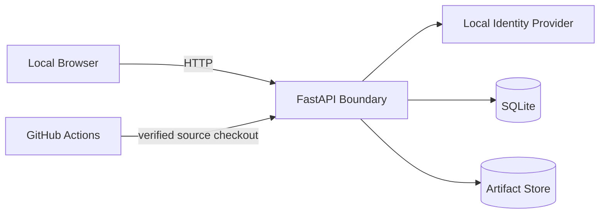

# Security Architecture

| Field | Value |
|---|---|
| Document ID | TDP-ARC-006 |
| Status | Controlled draft |
| Owner | Security and Architecture |
| Classification | Internal project documentation |
| Review cadence | At each material change or release |
| Source of truth | This repository |

## Current trust boundaries



## Implemented controls

- environment configuration through `pydantic-settings`;
- local identity prohibited in staging and production;
- mutation actor derived from `RequestPrincipal`;
- request ID propagation;
- CORS allowlist;
- baseline security headers;
- parameterized SQL;
- safe artifact keys and file-size limits;
- no execution of uploaded OpenAPI files;
- secrets and runtime data excluded from Git;
- CI quality gate and Dependabot;
- liveness and readiness endpoints.

## Current gaps

- no OIDC;
- no RBAC or workspace membership;
- no separation of duties;
- no rate limiting;
- no production secret manager;
- no centralized security logging;
- no formal vulnerability-scanning gate;
- no secure outbound acquisition boundary;
- no production deployment hardening.

## Future remote-evidence boundary

Remote acquisition must enforce:

```text
approved connector policy
host allowlist
DNS and redirect revalidation
private-network restrictions
TLS verification
timeouts and response-size limits
credential isolation
field classification and redaction
audit trail
```

## Assurance statement

The current local identity supports development traceability only. It is not legal non-repudiation and must not be presented as enterprise authentication.
