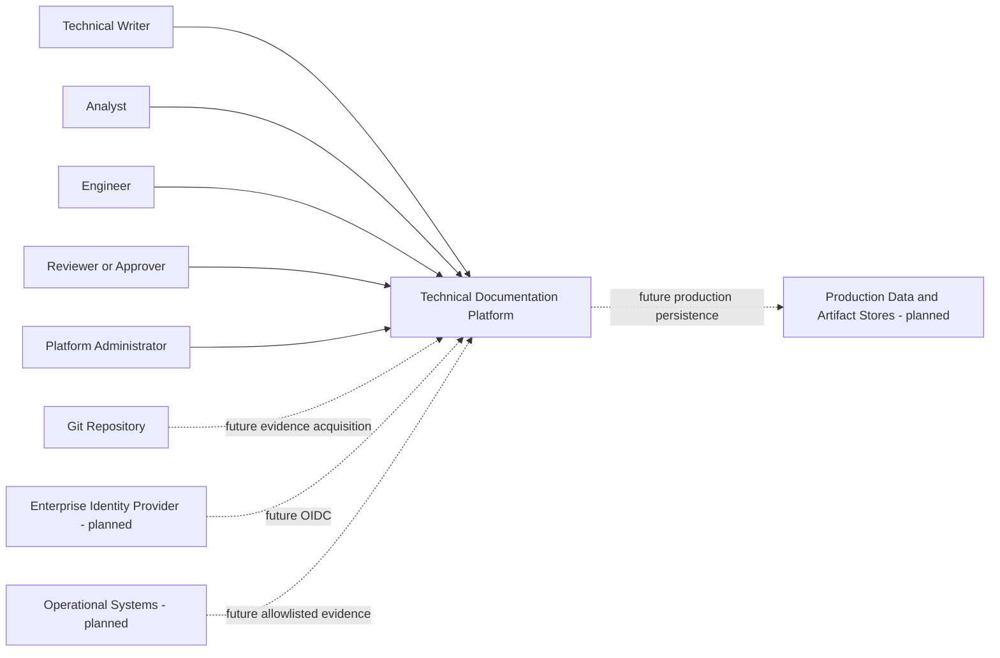

# System Context

| Field | Value |
|---|---|
| Document ID | TDP-ARC-001 |
| Status | Controlled draft |
| Owner | Architecture |
| Classification | Internal project documentation |
| Review cadence | At each material change or release |
| Source of truth | This repository |

## Purpose

Describe users, the platform boundary, current external dependencies, and planned integrations.

## Current boundary

The current system accepts local OpenAPI uploads, stores evidence and metadata locally, exposes a FastAPI HTTP API, and presents a React workbench.

## External systems

| System | Current relationship | Trust status |
|---|---|---|
| Browser | Active presentation client | Local trusted development |
| GitHub | Source repository and CI | Active |
| Enterprise identity provider | Not integrated | Planned |
| Git repository evidence connector | Not integrated | Planned |
| Remote operational APIs | Not integrated | Planned and prohibited until security controls exist |
| PostgreSQL or object storage | Not integrated | Planned |

## Context rules

- A remote system is not trusted merely because a user supplies its URL.
- Credentials are references managed outside factual document content.
- Generated documents must retain provenance to immutable evidence snapshots.
