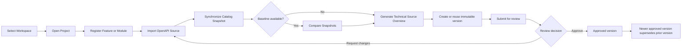
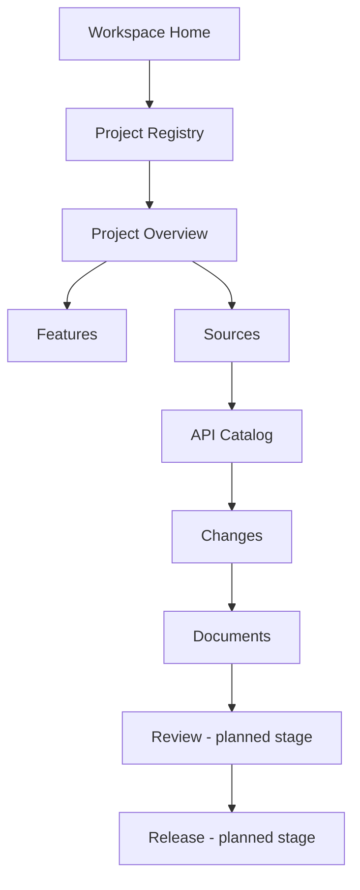
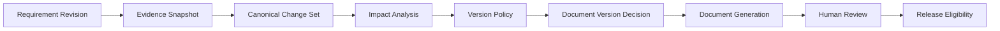

# User Flows

| Field | Value |
|---|---|
| Document ID | TDP-PROD-004 |
| Status | Controlled draft |
| Owner | Product Management and User Experience |
| Classification | Internal project documentation |
| Review cadence | At each material change or release |
| Source of truth | This repository |

## Current source-to-document flow

## Current navigation flow

## Future governed version flow

## Flow rules

- Workspace context remains active while a Project is open.
- Project and Feature identity must not be inferred from a free-text document.
- A generated version records evidence and policy references.
- Approval is a governed mutation and must never accept a client-supplied actor.
- Planned steps must remain visibly marked as planned until implemented.
