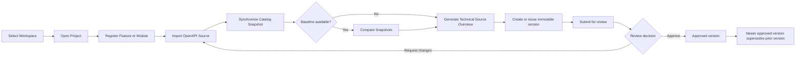
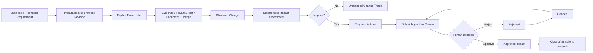
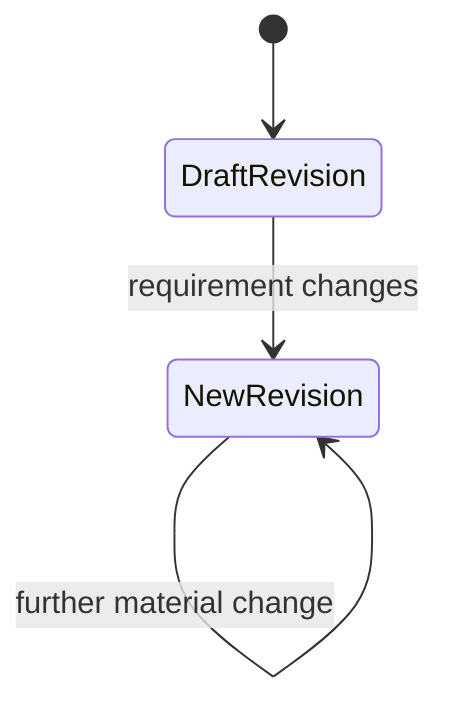
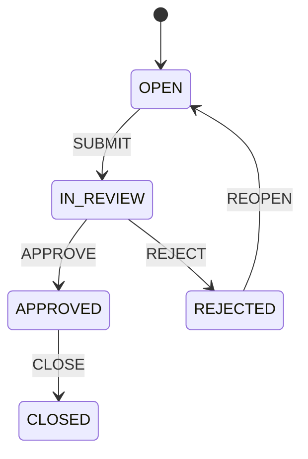

# User Flows

| Field | Value |
|---|---|
| Document ID | TDP-PROD-004 |
| Status | Controlled draft |
| Owner | Product Management and User Experience |
| Classification | Internal project documentation |
| Review cadence | At each material change or release |
| Source of truth | This repository |

## Current source-to-document flow


```mermaid
flowchart LR
W[Select Workspace] --> P[Open Project]
P --> F[Register Feature or Module]
F --> S[Import OpenAPI Source]
S --> Y[Synchronize Catalog Snapshot]
Y --> C{Baseline available?}
C -- Yes --> D[Compare Snapshots]
C -- No --> G[Generate Technical Source Overview]
D --> G
G --> V[Create or reuse immutable version]
V --> R[Submit for review]
R --> Q{Review decision}
Q -- Request changes --> S
Q -- Approve --> A[Approved version]
A --> N[Newer approved version supersedes prior version]
```

## Project information architecture

The project workbench is organized around the user decision chain rather than independent technical tools:

```text
Overview
→ Features
→ Sources
→ API Catalog
→ Changes
→ Evidence
→ Documents
```

Requirement and impact governance is currently exposed through the governed project API and is scheduled for a dedicated project workbench surface before pilot. It must not be presented as a generic global menu because requirement and impact decisions require Project context.

## Governed requirement-to-impact flow


```mermaid
flowchart LR
BR[Business or Technical Requirement] --> RR[Immutable Requirement Revision]
RR --> TL[Explicit Trace Links]
TL --> EV[Evidence / Feature / Test / Document / Change]
EV --> CH[Observed Change]
CH --> IA[Deterministic Impact Assessment]
IA --> M{Mapped?}
M -- No --> TR[Unmapped Change Triage]
M -- Yes --> ACT[Required Actions]
ACT --> SUB[Submit Impact for Review]
SUB --> DEC{Human Decision}
DEC -- Reject --> REJ[Rejected]
REJ --> O[Reopen]
O --> SUB
DEC -- Approve --> APP[Approved Impact]
APP --> CLO[Close after actions complete]
```

## Requirement revision flow


```mermaid
stateDiagram-v2
[*] --> DraftRevision
DraftRevision --> NewRevision: requirement changes
NewRevision --> NewRevision: further material change
```

Requirement content is append-only. A material edit creates a new revision with `previous_revision_id`; the prior revision is retained for audit and traceability.

## Impact workflow state machine


```mermaid
stateDiagram-v2
[*] --> OPEN
OPEN --> IN_REVIEW: SUBMIT
IN_REVIEW --> APPROVED: APPROVE
IN_REVIEW --> REJECTED: REJECT
REJECTED --> OPEN: REOPEN
APPROVED --> CLOSED: CLOSE
```

Direct `OPEN → APPROVED` transitions are invalid. The platform records the server-resolved actor, action, previous state, new state, comment, and timestamp for every accepted transition.

## Traceability semantics

Supported trace targets:

- Feature / Module;
- Evidence artifact;
- Document;
- Test / verification evidence;
- Change reference.

Supported relations:

- `IMPLEMENTED_BY`;
- `VERIFIED_BY`;
- `DOCUMENTED_BY`;
- `DERIVED_FROM`;
- `AFFECTED_BY`.

The impact engine uses these explicit relationships only. It must not infer an undocumented relationship and then present it as fact.

## Flow rules

- Workspace context remains active while a Project is open.
- Project and Feature identity must not be inferred from free-text documentation.
- Requirement revisions are immutable; changes append a new revision.
- Evidence remains the factual source-of-truth layer; Requirement and Impact governance reference it instead of copying evidence facts.
- A generated version records evidence and policy references.
- An unmapped change produces an explicit triage action rather than a false no-impact decision.
- Approval is a governed mutation and must never accept a client-supplied actor.
- AI may recommend trace candidates or summarize impacts, but official trace links and approval decisions remain governed human/accountable actions.
- Dedicated governance UX remains before-pilot work and must preserve the state machine and trace semantics defined here.
