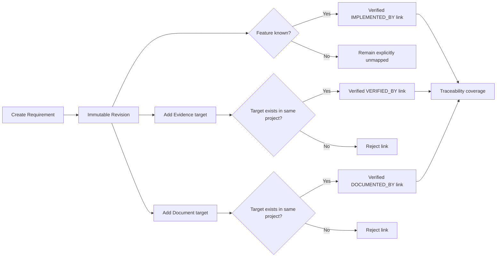
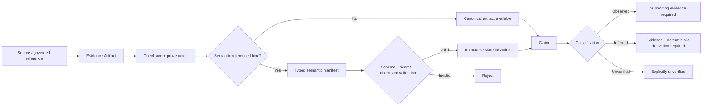
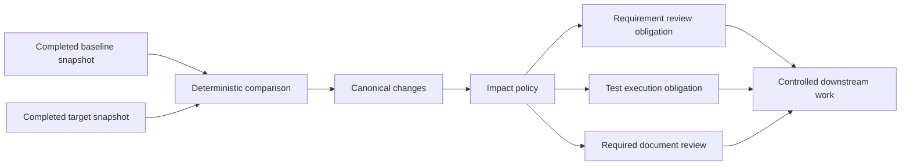
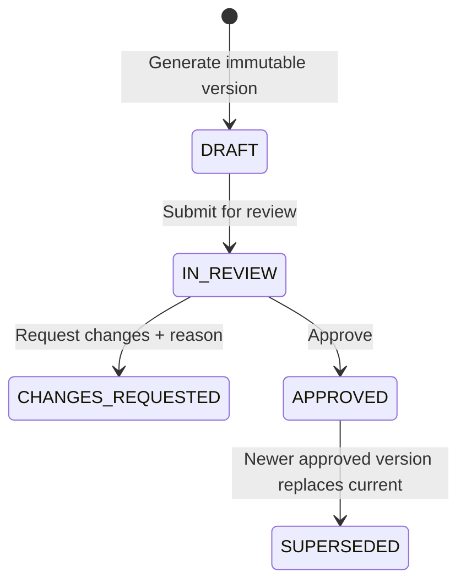
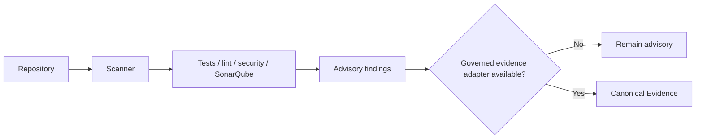
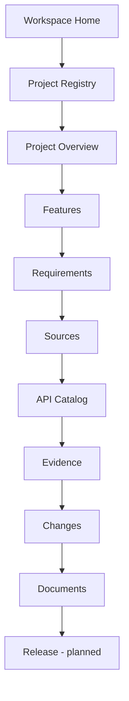

# User Flows

| Field | Value |
|---|---|
| Document ID | TDP-PROD-004 |
| Status | Controlled draft |
| Owner | Product Management and User Experience |
| Classification | Internal project documentation |
| Review cadence | At each material change or release |
| Source of truth | This repository |

## Canonical project workbench flow

```mermaid
flowchart LR
W[Workspace] --> P[Project]
P --> F[Feature or Module]
F --> R[Requirement Revision]
R --> S[Source Intake]
S --> E[Evidence]
E --> C[Change Detection]
C --> I[Impact Assessment]
I --> D[Document Version]
D --> H[Human Review / Approval]
H --> X[Release - planned]
```

The workbench may recommend a next action, but upstream governance boundaries remain explicit. A UI convenience must never synthesize a requirement, evidence record, verified trace, impact decision, or approval.

## Requirement and traceability flow

```mermaid
flowchart LR
A[Create Requirement] --> B[Immutable Revision]
B --> F{Feature known?}
F -- Yes --> FL[Verified IMPLEMENTED_BY link]
F -- No --> P[Remain explicitly unmapped]
B --> EL[Add Evidence target]
EL --> EV{Target exists in same project?}
EV -- Yes --> VL[Verified VERIFIED_BY link]
EV -- No --> ER[Reject link]
B --> DL[Add Document target]
DL --> DV{Target exists in same project?}
DV -- Yes --> DO[Verified DOCUMENTED_BY link]
DV -- No --> DR[Reject link]
VL --> TC[Traceability coverage]
DO --> TC
FL --> TC
```

## Source and evidence flow

```mermaid
flowchart LR
S[Source / governed reference] --> A[Evidence Artifact]
A --> K[Checksum + provenance]
K --> T{Semantic referenced kind?}
T -- No --> C[Canonical artifact available]
T -- Yes --> M[Typed semantic manifest]
M --> V{Schema + secret + checksum validation}
V -- Valid --> IM[Immutable Materialization]
V -- Invalid --> RJ[Reject]
C --> CL[Claim]
IM --> CL
CL --> Q{Classification}
Q -- Observed --> OE[Supporting evidence required]
Q -- Inferred --> IE[Evidence + deterministic derivation required]
Q -- Unverified --> UE[Explicitly unverified]
```

## API change and impact flow

```mermaid
flowchart LR
B[Completed baseline snapshot] --> CP[Deterministic comparison]
T[Completed target snapshot] --> CP
CP --> CH[Canonical changes]
CH --> IP[Impact policy]
IP --> RR[Requirement review obligation]
IP --> TE[Test execution obligation]
IP --> DR[Required document review]
RR --> WK[Controlled downstream work]
TE --> WK
DR --> WK
```

Current deterministic impact coverage is strongest for normalized API operations and schemas. Other technical domains remain controlled extensions rather than inferred behavior.

## Governed document workflow

```mermaid
stateDiagram-v2
    [*] --> DRAFT: Generate immutable version
    DRAFT --> IN_REVIEW: Submit for review
    IN_REVIEW --> CHANGES_REQUESTED: Request changes + reason
    IN_REVIEW --> APPROVED: Approve
    APPROVED --> SUPERSEDED: Newer approved version replaces current
```

For verified identities, approval also evaluates separation of duties. The author of a document version cannot approve that same version. Local evaluation identity is an explicit non-production exception.

## Repository Scanner boundary

```mermaid
flowchart LR
R[Repository] --> S[Scanner]
S --> T[Tests / lint / security / SonarQube]
T --> A[Advisory findings]
A --> G{Governed evidence adapter available?}
G -- No --> H[Remain advisory]
G -- Yes --> E[Canonical Evidence]
```

Scanner output must not silently become an official fact.

## Navigation flow

```mermaid
flowchart TD
H[Workspace Home] --> PR[Project Registry]
PR --> O[Project Overview]
O --> FT[Features]
FT --> RQ[Requirements]
RQ --> SO[Sources]
SO --> AC[API Catalog]
AC --> EV[Evidence]
EV --> CH[Changes]
CH --> DO[Documents]
DO --> RL[Release - planned]
```

## Flow rules

- Workspace and Project boundaries are explicit and stable.
- Project and Feature identity must not be inferred from free-text documentation.
- Requirement edits create revisions; prior revisions remain auditable.
- Verified trace links require an existing target inside the same Project.
- Evidence preserves provenance and checksum identity.
- Semantic materialization requires the typed manifest contract; an empty or guessed payload is invalid.
- Impact obligations are calculated by deterministic backend policy, not by presentation labels.
- A generated version records evidence and policy references.
- Approval is a governed mutation and must never accept a client-supplied actor.
- Verified author self-approval is prohibited.
- Planned steps remain visibly marked as planned until implemented and tested.
