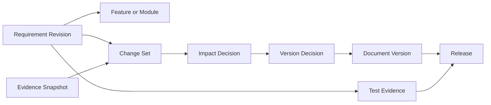

# Traceability Model

| Field | Value |
|---|---|
| Document ID | TDP-QUAL-003 |
| Status | Controlled draft |
| Owner | Product, Technical Documentation, and Quality |
| Classification | Internal project documentation |
| Review cadence | At each material change or release |
| Source of truth | This repository |

## Current traceability

```text
Source Artifact
→ SHA-256 checksum
→ Synchronization Run
→ Normalized API Operation or Schema
→ JSON Pointer evidence
→ Change Comparison
→ Generated Document
→ Content checksum
→ Document Version
→ Workflow Event
```

## Repository traceability

```text
Controlled document
→ Git path
→ reviewed diff
→ commit
→ CI quality result
→ generated document register
```

## Current limitation

Most requirement files do not yet use stable requirement IDs, and tests generally do not reference requirement IDs. The generated Requirements Index therefore reports file-level coverage rather than complete requirement-to-test traceability.

## Target traceability



## Required future identifiers

- Requirement ID and revision;
- Evidence Snapshot ID and checksum;
- Change Set ID;
- policy ID and version;
- impact decision ID;
- document profile and template version;
- test evidence ID;
- release ID;
- principal and authorization decision.

## Rule

A document statement must not claim traceability beyond the relationships actually stored and verified by the system.
